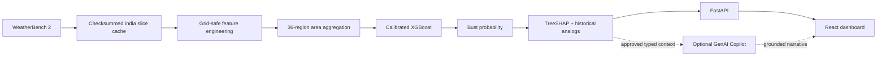
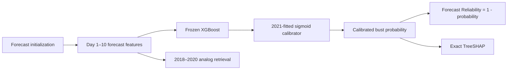
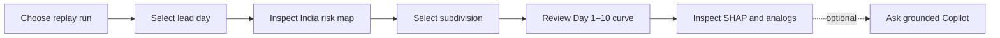

# Forecast Bust Detection: Data, ML, Evidence, Dashboard, and Grounded Copilot

This repository implements the complete P0 data and scientific pipeline plus the optional P1 grounded Copilot: WeatherBench validation, the complete five-year monsoon corpus, training-only robust labels, baselines, calibrated XGBoost, held-out reporting, exact TreeSHAP, training-only analogs, a read-only FastAPI service, and an evidence-first React dashboard. The Copilot is strictly downstream, may use Gemini when configured, and otherwise returns a deterministic evidence summary without affecting P0.

## At a glance

| Question | Answer |
|---|---|
| Problem | Medium-range numerical weather forecasts can occasionally develop unusually large multivariate errors—forecast busts—during high-impact, rapidly evolving conditions. |
| Solution | Estimate a calibrated bust probability for each of 36 IMD meteorological subdivisions and Day 1–10 lead, then expose the evidence behind it. |
| Primary users | NCMRWF/MoES forecasters, verification analysts, and SIH evaluators. |
| Scientific model | XGBoost fitted on 2018–2020, selected and sigmoid-calibrated with isolated 2021 data, evaluated once on untouched 2022 data. |
| Explainability | Exact TreeSHAP contributions and three training-only nearest historical analogs. |
| Interface | FastAPI plus a Carbon React dashboard with risk map, lead curve, Forecast Reliability, evidence, and optional grounded Copilot. |

This is a historical-replay research prototype, not an official forecast or warning system.

## Architecture



### Prediction flow



### Judge/user interaction



## Verified held-out results

All values below come from the untouched 2022 evaluation artifact over 87,840 rows.

| Metric | Value |
|---|---:|
| PR-AUC (primary) | 0.754087 |
| ROC-AUC | 0.916438 |
| Brier score | 0.076600 |
| Brier Skill Score vs. climatology | 0.448570 |
| Expected calibration error | 0.025257 |
| Recall within the top 20% predicted risk | 0.726949 |

## Setup

```powershell
python -m pip install -e ".[dev,regrid]"
```

On Windows, `xesmf` may be importable only after installing an ESMF/esmpy runtime. The current WeatherBench ENS and HRES 1.5-degree grids are identical, so the smoke pipeline uses exact alignment and persists a hashed identity-alignment artifact. A non-identical grid fails with an actionable ESMF error rather than silently interpolating.

## Reproduce the live smoke dataset

```powershell
forecast-bust smoke --initialization 2020-06-01T00:00:00 --lead-hours 24
```

Outputs are written under `data/processed/`, `data/weights/`, `data/geometry/`, and `data/manifests/`. Raw/cache content remains under ignored `data/cache/`.

## Build and evaluate the complete corpus

```powershell
# Diagnose and benchmark acquisition before corpus work.
forecast-bust diagnose-reads
forecast-bust benchmark-concurrency
forecast-bust benchmark-acquisition
forecast-bust project-acquisition

# Fetch and derive can be run independently and resumed.
forecast-bust fetch-source-slices --initialization 2020-06-01T00:00:00
forecast-bust build-derived --initialization 2020-06-01T00:00:00

# Atomic per-initialization partitions; safe to interrupt and rerun.
forecast-bust build-full

# Fit medians, MADs, fallbacks, and q85 thresholds on 2018-2020 only.
forecast-bust label

# Select on 2021 PR-AUC, calibrate on 2021, evaluate once on 2022.
forecast-bust train

# Fit and hash the training-only analog standardizer.
forecast-bust build-evidence
```

For controlled operational batches, use `forecast-bust build-full --max-cycles N`; a later invocation resumes from verified partitions. `forecast-bust ml-gate` runs all three stages and refuses to train while the corpus manifest is incomplete.

The full dataset is partitioned under `data/processed/year=YYYY/month=MM/`. Learned objects and their hashes are stored under `data/artifacts/`, and held-out predictions and the metric report are stored under `data/reports/`.

## Run the read-only API

```powershell
forecast-bust api
```

Open `http://127.0.0.1:8000/docs` for the generated OpenAPI UI. The service reads verified saved artifacts only; it does not retrain. It exposes health, model metadata, replay runs, the canonical region manifest and GeoJSON, risk maps, lead curves, and deterministic SHAP-plus-analog explanations. To reproduce the local latency report:

```powershell
forecast-bust benchmark-api
```

The report is written to `data/reports/api-benchmark.json`.

## Run the dashboard

Keep the API running, then open a second PowerShell terminal:

```powershell
Set-Location frontend
Copy-Item .env.example .env.local
npm install
npm run dev
```

Open `http://127.0.0.1:5173`. The default `.env.example` points to the local API. To use another read-only API origin, set `VITE_API_BASE_URL`; add its browser origin to `FORECAST_BUST_CORS_ORIGINS` on the API. The UI defaults to the latest verified replay run and exposes the 36-region risk map, Day 1-10 curve, Forecast Reliability, exact SHAP drivers, training-only analogs, and the secondary Copilot panel.

## Configure the optional Copilot

Copy `.env.example` values into the backend process environment. P0 and the Copilot endpoint work with deterministic fallback when `LLM_ENABLED=false` (the default). To enable Gemini, set `LLM_ENABLED=true`, `LLM_PROVIDER=gemini`, an explicit `LLM_MODEL`, and backend-only `GEMINI_API_KEY`. The prompt version defaults to `copilot-v1`; timeout, output, per-IP rate, cache size, and SQLite cache path are configurable. Never put provider credentials in the frontend or a `VITE_*` variable.

The endpoint is `POST /v1/copilot/query`. It accepts a prediction ID, a question of at most 500 characters, and `simple` or `meteorological` mode. Only the validated hard-allowlisted evidence context reaches the provider. Successful provider output is cached by prediction, question, mode, scientific versions, prompt, provider, and model; fallback output is not stored as provider output.

## Project structure

```text
src/forecast_bust/       Scientific pipeline, artifact validation, evidence, API, Copilot
frontend/                React/TypeScript/Carbon dashboard
tests/                   Offline scientific, leakage, API, artifact, and Copilot tests
data/manifests/          Corpus and labeled-layer reproducibility manifests
data/diagnostics/        Acquisition measurements and source-layout evidence
data/reports/            Aggregate held-out metrics; local prediction Parquet is excluded
docs/                    Submission diagrams and screenshot plan
scripts/                 Resumable local ML-gate helper
prd.md                   Product requirements
tech.md                  Scientific and technical contract
flow.md                  Data, training, runtime, and failure flows
agents.md                Binding implementation constraints
```

Large local artifacts remain outside Git because raw redistribution is prohibited and derived redistribution is license-gated. The local artifact set is hash-validated before API startup.

## Reproducibility guarantees

- Dataset version: `wb2-ifs-mean-india-v2`.
- Feature contract: `mean-only-mvp-v2`.
- Model version: `xgb-bust-v2-mean-only`.
- Train/validation/test initialization years are mutually isolated: 2018–2020 / 2021 / 2022.
- Every consumed partition, model object, calibrator, preprocessor, scaler, manifest, and weight file is checked against its recorded SHA-256.
- The authoritative definitions, equations, contracts, and safeguards live in `prd.md`, `tech.md`, `flow.md`, and `agents.md`.

## Tests

```powershell
pytest
# Explicit network contract check (requires stable access to Google Storage):
pytest -m cloud -o addopts="-ra"

Set-Location frontend
npm run test
npm run typecheck
npm run lint
npm run build
```

The default suite is deterministic and offline. The opt-in cloud test reads consolidated Zarr metadata only; unit tests use small in-memory fixtures.

## Deployment readiness

### Frontend on Vercel

Use `frontend/` as the project root. Vercel reads `frontend/vercel.json`, runs `npm run build`, and publishes `dist`. Copy `frontend/.env.production.example` into the Vercel environment and set `VITE_API_BASE_URL` to the HTTPS Render origin. Add the exact Vercel browser origin to backend `FORECAST_BUST_CORS_ORIGINS`; comma-separate multiple explicit origins.

### Backend container and Render

The root `Dockerfile` produces a non-root Python 3.11 API container, binds `0.0.0.0:$PORT`, and checks `/health`. The image intentionally contains no dataset or model artifacts. For a local container, mount the validated runtime `data/` tree read-only and put the Copilot cache in writable ephemeral storage:

```powershell
docker build -t forecast-bust-api .
docker run --rm -p 8000:10000 `
  -e PORT=10000 `
  -e FORECAST_BUST_DATA_ROOT=/app/data `
  -e COPILOT_CACHE_PATH=/tmp/copilot-cache.sqlite `
  -v "${PWD}/data:/app/data:ro" forecast-bust-api
```

`render.yaml` defines the Docker service, `/health`, CORS configuration, disabled-by-default LLM, and secret placeholders. Auto-deploy is deliberately off. Before a hosted Render release, supply a private, immutable artifact-delivery mechanism for `FORECAST_BUST_DATA_ROOT` and confirm that derived-artifact redistribution is licensed. Do not copy raw WeatherBench arrays into an image. That artifact-delivery/license gate is the current hosted-deployment blocker; no deployment was performed.

### Environment templates

- Backend: `.env.example`
- Local frontend: `frontend/.env.example`
- Production frontend: `frontend/.env.production.example`

Historical manifests may contain their original Windows build paths. Runtime relocation maps only the suffix below `data/` into `FORECAST_BUST_DATA_ROOT`, then revalidates every existing schema and SHA-256. Unmappable or escaping paths fail startup.

## Limitations

- Historical replay only; there is no live forecast ingestion in the MVP.
- The production contract uses the official IFS ENS mean product and no raw ensemble-member spread because the measured transfer requirement was unsuitable for the four-day prototype.
- Output quality depends on the WeatherBench period, HRES verification, regional aggregation, and the fixed bust-label definition.
- This is decision support, not a meteorological warning, hazard forecast, or replacement for expert analysis.
- Raw redistribution is prohibited and derived redistribution remains disabled until all applicable source and geometry licenses are confirmed.
- Hosted backend deployment still needs a private artifact-delivery mechanism.

## Future work

- Add true ensemble-spread features after establishing suitable compute and data-transfer infrastructure.
- Build a validated adapter for current operational forecast cycles without altering training isolation.
- Evaluate additional regions and forecast systems with locally validated geometry, units, and calibration.
- Study longer retrospective periods and event-specific verification under an approved research protocol.

## References

- [WeatherBench 2 data guide](https://weatherbench2.readthedocs.io/en/latest/data-guide.html)
- [WeatherBench 2 repository](https://github.com/google-research/weatherbench2)
- [ECMWF TIGGE data documentation](https://www.ecmwf.int/en/forecasts/dataset/tigge)
- [India Meteorological Department — Indian meteorological zones source](https://github.com/India-Meteorological-Department/Indian_met_zones)
- [XGBoost documentation](https://xgboost.readthedocs.io/)
- [IBM Carbon Design System](https://carbondesignsystem.com/)

## Verified project status (29 September 2026)

- P0 corpus: 439,200 labeled rows; frozen model `xgb-bust-v2-mean-only`; exact TreeSHAP, three training-only analogs, read-only API, and Carbon dashboard complete.
- Held-out 2022 model metrics from `data/reports/model-evaluation.json`: PR-AUC `0.754087`, ROC-AUC `0.916438`, Brier `0.076600`, Brier Skill Score `0.448570`, ECE `0.025257`, and top-20%-risk recall `0.726949` over 87,840 rows.
- P1: backend-only Gemini abstraction, prompt `copilot-v1`, typed hard allowlist, percentage/probability checks, hazardous-event/causality guard, one strict retry, hashed bounded SQLite cache, explicit insufficient-evidence fallback, and downstream dashboard panel complete.
- Verification: 46 backend tests passed with one opt-in cloud test deselected; 13 frontend tests passed; TypeScript, ESLint, production build, Python compilation, dependency check, npm audit, real-artifact browser flow, console-error check, and horizontal-overflow check passed.
- Local benchmark (`forecast-bust benchmark-api`, five samples/endpoint): application construction `170.97 ms`; risk map median `24.22 ms`; lead curve `23.43 ms`; deterministic explanation `106.06 ms`. Real local HTTP Copilot fallback with `LLM_ENABLED=false` was `112.01 ms` median over five samples. The successful-provider cache path, measured with an in-process deterministic mock because no Gemini credentials were available, was `5.00 ms` cold and `1.52 ms` cached over eight pairs; these figures exclude provider network latency.
- Deployment: Vercel files are ready and Render/Docker configuration is authored. No deployment occurred. Docker execution was not verified because the local daemon was unavailable; Render schema CLI validation was unavailable, while YAML/JSON syntax checks passed. Hosted Render remains blocked by private artifact delivery and derived-redistribution license confirmation.
