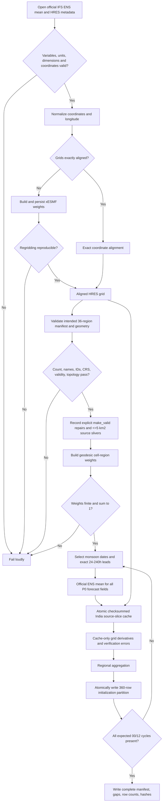
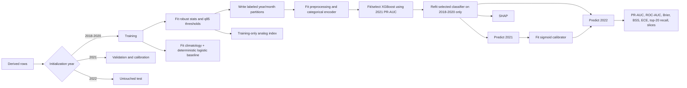
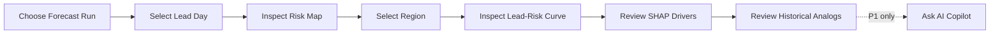
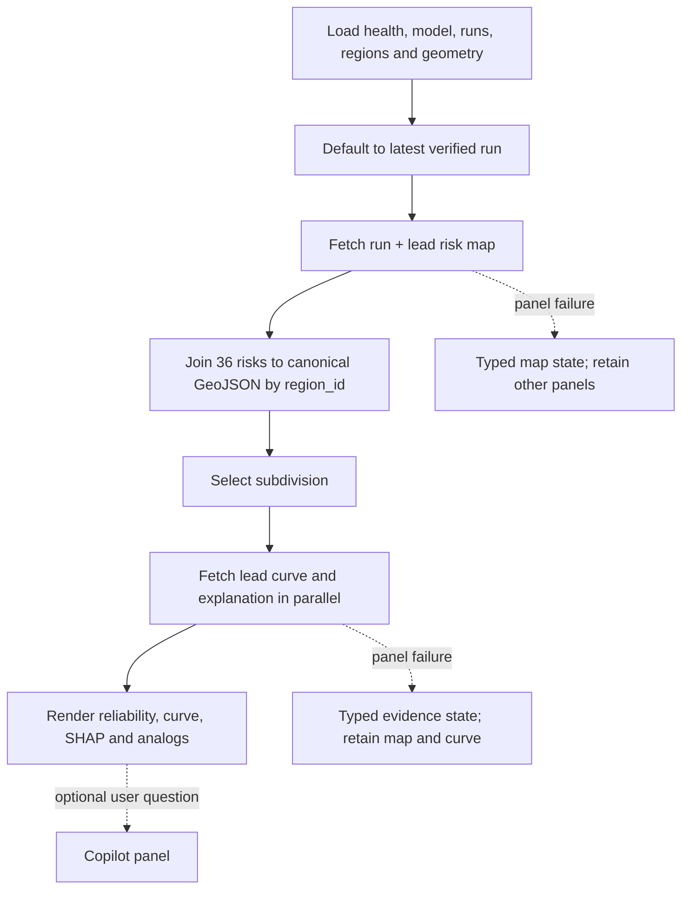

# Forecast Bust Detection Application Flow

## Priority and trust boundary

P0 is the complete scientific product. P1 GenAI is a downstream explanation convenience and may be disabled. XGBoost is the only authoritative bust-risk model.

```mermaid
flowchart LR
    WB[WeatherBench 2] --> FE[Feature Engineering]
    FE --> XGB[XGBoost]
    XGB --> CAL[Probability Calibration]
    CAL --> BP[Bust Probability]
    BP --> EA[SHAP + Historical Analogs]
    EA --> DASH[Dashboard]

    EA --> CTX[Approved Evidence + Prediction Metadata]
    CTX --> AI[Optional GenAI Copilot]
    AI --> NL[Natural-Language Explanation]
    NL --> DASH

    classDef science fill:#d6e4ff,stroke:#0f62fe,color:#161616;
    classDef optional fill:#f4f4f4,stroke:#8d8d8d,color:#161616,stroke-dasharray: 5 5;
    class WB,FE,XGB,CAL,BP,EA,DASH science;
    class CTX,AI,NL optional;
```



The dashed branch consumes finished evidence. It cannot write to the scientific path.

## Offline dataset flow



The production flow has no raw-member edge. Optional post-MVP research mode may acquire full-member spread separately, but it is not part of the P0 schema or ML gate. Deterministic run-to-run drift, lead time, gradients, vorticity, and precipitation magnitude must not be labeled as ensemble spread. Downstream context retains only explicit approved feature values and optional run-to-run drift.

The mean-only feature stage emits 2 m temperature, MSLP, 10 m u/v and wind speed, 850 hPa wind/vorticity, 500-850 hPa thickness, 24-hour precipitation, MSLP gradient, run-to-run drift, lead day, seasonal encoding, and categorical region ID.

## Training, calibration, and evaluation



No arrow returns from validation or test data to training statistics or classifier fitting.

## Runtime application flow



At every step, retain `run_id`, `prediction_id`, source time, valid time, model version, dataset version, and provenance.

The implemented dashboard continues from deterministic SHAP and analog evidence into the secondary P1 panel. The dashed P1 step is optional, resets whenever prediction identity changes, and is never required for P0 runtime.



## Prediction request

```mermaid
sequenceDiagram
    participant U as User
    participant UI as Dashboard
    participant API as FastAPI
    participant DS as DuckDB/Artifacts

    U->>UI: Select run and lead
    UI->>API: GET /v1/risk-map
    API->>DS: Query verified held-out prediction Parquet
    DS-->>API: RegionRisk records
    API-->>UI: Risk map + provenance
    U->>UI: Select subdivision
    UI->>API: GET lead-curve and explanation
    API->>DS: Query prediction + allowed forecast features
    DS-->>API: Frozen classifier, calibrator, scaler, training candidates
    API->>API: Validate calibrated probability
    API->>API: Exact TreeSHAP in saved transformed space
    API->>API: Same-region/same-lead analog rank; deterministic fallback
    API-->>UI: Evidence panels
```

Runtime identity is deterministic: `run-YYYYMMDDTHHMMSSZ` and `<model_version>__YYYYMMDDTHHMMSSZ__imd-NN__dNN`. The API validates hashes and schemas before serving. Geometry references resolve through `GET /v1/regions/geojson`; scientific responses come only from saved real-data artifacts.

## Copilot request and graceful failure

```mermaid
sequenceDiagram
    participant UI as Dashboard
    participant API as FastAPI
    participant EV as Evidence Store
    participant LLM as LLM Provider

    UI->>API: POST /v1/copilot/query
    API->>EV: Load prediction evidence
    EV-->>API: Approved CopilotContext fields
    API->>API: Typed allowlist, serialize untrusted data, build versioned cache key
    alt Valid cache hit
        API-->>UI: Cached answer + grounding + versions
    else Provider enabled
        API->>API: Apply process-local rate limit
        API->>LLM: Immutable prompt + typed CopilotContext
        LLM-->>API: Candidate narrative
        API->>API: Validate numbers and event/causality claims; retry once
        API-->>UI: Answer + deterministic evidence
    else Disabled, timeout, quota, or error
        API->>API: Build deterministic probability/SHAP/analog summary
        API-->>UI: Degraded response + grounding + versions
        UI->>UI: Show warning and keep every P0 panel visible
    end
```

Only successful provider narratives enter the bounded hashed SQLite cache. Disabled and failure fallbacks are not cached as provider answers. The cache key includes prediction, normalized-question hash, mode, scientific model and dataset versions, prompt version, provider, and provider model.

## UI states

| State | Required behavior |
|---|---|
| Loading | Layout-matched skeletons; do not show stale values as current |
| Empty | Explain that no versioned run/lead data is available |
| Partial | Identify missing regions/evidence and retain valid records |
| Stale | Show source forecast time and explicit stale indicator |
| Core API error | Contextual retry and request ID |
| Copilot unavailable | Show the fixed unavailable message; retain all P0 evidence |

All replay timestamps are displayed as UTC. Responsive layouts collapse to one column without changing query parameters, selected identifiers, probabilities, or evidence.

## Change control

Any change to a dataset field, feature meaning, unit, entity, endpoint, response field, or copilot allowlist requires synchronized updates to `prd.md`, `tech.md`, `flow.md`, `agents.md`, and `README.md`.
